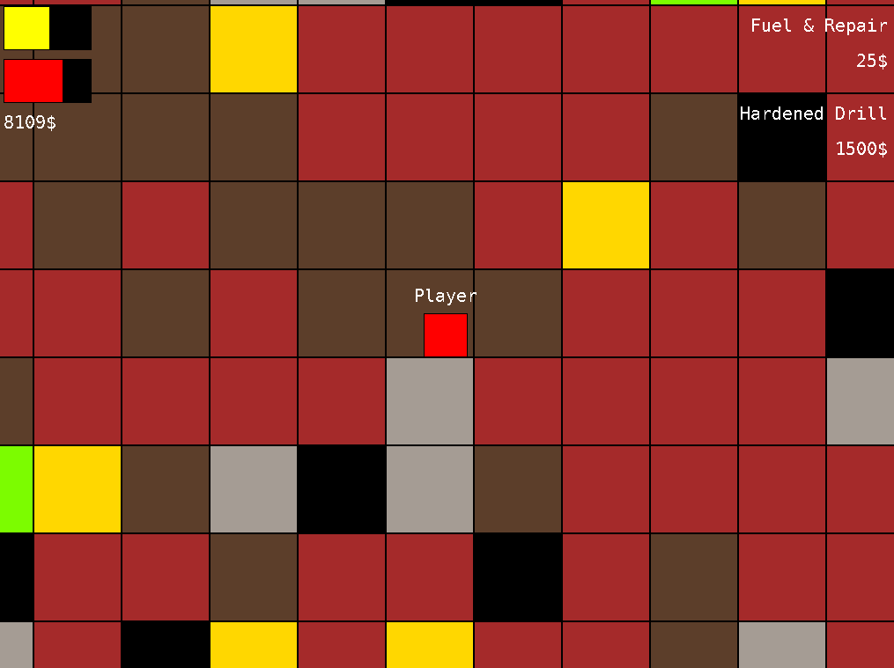

# Motherload game clone

Greatly simplified imitation of Motherload,
a flash game playable for example [here](https://www.crazygames.com/game/motherload),
made as a semestral project in [FIT CTU](https://fit.cvut.cz/cs)'s "Programming and Algorithms 2" class.

The assignment (available in full in czech language in file [zadani.txt](zadani.txt)) in short was to make
a simple 2D survival game in `C++`. Additional requirements were to use polymorphism,
include configurable random map generation, ability to load map from a file and saving feature.

## How to play

Requirements:
- SDL2 dev library, see [here](https://wiki.libsdl.org/SDL2/Installation)
- SDL2-tff dev library, see [here](https://github.com/libsdl-org/SDL_ttf)
- Doxygen, see [here](https://www.doxygen.nl/)
- Make, see [here](https://www.gnu.org/software/make/)
- C++ compiler supporting C++17

````bash
$ make doc # builds Doxygen documentation into "doc" folder
$ make compile # compile the game 
$ ./tomanma9 # run the game
````


## Game

Goal of the game is to survive for as long as possible by mining different valuable
minerals, which rewards the player money for fuel, health and upgrades.

### Shop

It is possible to fill health & armor meters and buy upgrades when on surface.
Upgrades are unlocked ín linear progression cycling fuel/mining/armor upgrades up to 4 tiers each.

### Saving & loading

The game can be saved into a file whenever playing by pressing the `I` button.
Saved game are stored in the `saves` folder and contain the time of creation in their name.
When booting the game add path to saved game file to load and continue playing that save.
As an example, see [SAVE_STATE_FIT.txt](examples/SAVE_STATE_FIT.txt) in examples directory.

### World generation

When the game is run without arguments a new world is generated.
To use custom world generation settings pass the configuration file to the program.
As an example, see [WEIRD_MAP_GEN.txt](examples/WEIRD_MAP_GEN.txt) in examples directory

### Controls

- `WASD / arrow keys` - movement
- `Spacebar` - mining in direction of movement
- `R` - buy health & armor on surface
- `U` - buy upgrade on surface
- `I` - save game

### Screenshots





